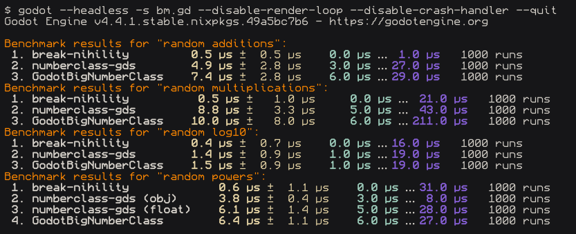

# break-nihility
Plugin for incremental games that needs to deal with massive numbers. Ported from [break_infinity.js](https://github.com/Patashu/break_infinity.js/).

## What even is this???
In Godot, there are 2 types to represent numbers:
- `int` can store numbers up to 2^63 - 1 but doesn't work on fractionals
- `float` goes up to 1.8e308, but loses precision on higher numbers

**Solution:** just combine them

```gdscript
class Decimal:
    var mantissa: float # double in C++ (8 bytes)
    var exponent: int   # int64_t in C++ (8 bytes)
    # essentially, the stored number is equal to: mantissa × 10^exponent
    # so the upper bound would be 1e(2^63), a number with 9223372036854775808 digits
```

This plugin adds the aforementioned `Decimal` class, along with several dozen functions to do math with them.

It's also designed with speed in mind, as it's written with [GDExtension](https://docs.godotengine.org/en/4.4/tutorials/scripting/gdextension/what_is_gdextension.html), and only allocates on stack (outside of stringification).

Anyways, this lets us quite literally break infinity™️.
```gdscript
func _ready() -> void:
    var d1 := Decimal.from_float(3e200)
    var d2 := Decimal.from_float(2e250)
    var result := Decimal.mul(d1, d2)

    print(
        Decimal.to_string(d1), " + ",
        Decimal.to_string(d2), " = ",
        Decimal.to_string(result)
    ) # prints "3.e+200 + 2.e+250 = 6.e+450"

    # floats would just give you infinity in this case
    print(3e200 * 2e250) # prints "inf"
```

## Installation
This repo is automatically built and mirrored to [peachey2k2/break-nihility-bin](https://github.com/peachey2k2/break-nihility-bin), which you can just copy into your own game.

## Benchmarks
i dug a bit and found a couple addons/scripts that do a similar thing
- [break-nihility](https://github.com/peachey2k2/break-nihility) - obama medal meme
- [GodotBigNumberClass](https://github.com/ChronoDK/GodotBigNumberClass) - same idea but in GDScript, also can do cool formatting
- [numberclass-gds](https://github.com/SWCreeperKing/numberclass-gds) - smaller plugin, less bloated

Also **numberclass-gds** is a GDScript port of [NumberClass](https://github.com/SWCreeperKing/NumberClass). I did try to patch it to work with Godot but it performs worse for most things due to GDScript-C# bridge.


